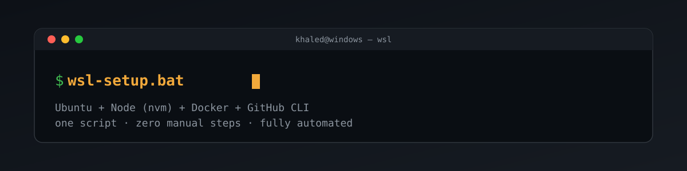
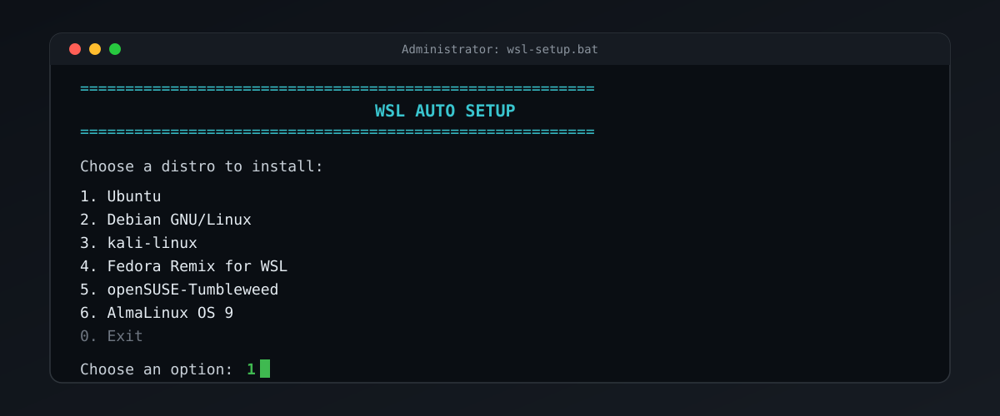

# wsl-setup



Fully automatic WSL setup for a Windows PC. Run one `.bat` file, pick any distro from a live numbered menu, and it does the rest — no interactive WSL setup wizard, no typing anything except a username/password once.



## Usage

1. Clone or download this repo onto your Windows machine.
2. Run `wsl-setup.bat` (double-click it, or run from `cmd.exe`). It self-elevates to Administrator via UAC.
3. Pick a distro from the numbered menu — built live from `wsl.exe --list --online`, so it's whatever Microsoft currently offers (Ubuntu, Debian, Fedora, Arch, openSUSE, Kali, AlmaLinux, Oracle Linux, and more), never a hardcoded list that goes stale.
4. Enter a new Linux username and password when prompted (password input is masked).
5. The script installs the distro (`wsl --install -d <name> --no-launch --web-download`), waits for it to become ready, then creates the Linux user itself — `useradd`, `chpasswd`, adds to `sudo`, and grants **passwordless sudo** (`/etc/sudoers.d/<user>`) so system commands run without a prompt.
6. It sets that user as the distro's default user, sets the distro as the **machine's** default (`wsl --set-default`), and verifies that typing plain `wsl` in any terminal drops straight into that user with no prompts.
7. It writes/refreshes `start-wsl.bat` next to itself — a one-line launcher (`wsl.exe`) for quick access afterward.
8. The window never closes itself — every path, success or error, ends with a pause so you can read the output.

## What it does differently from the built-in `wsl --install` wizard

- **No plaintext credentials anywhere.** The password is read via PowerShell's masked `Read-Host`, base64-encoded, and forwarded into the Linux environment through `WSLENV` — it's never written to a log, temp file, or disk, and never spliced as raw text into a shell command line (which would break or be exploitable if the password contained a quote character). It's cleared from the script's own memory (`set "wslPass="`) immediately after use.
- **Bypasses two documented first-install pitfalls:** uses `--web-download` (Microsoft's own fix for installs hanging at 0.0%) and checks the Windows build number up front (WSL needs build 19041+), instead of failing partway with a confusing error.
- **Explains the reboot case.** A first-ever WSL install on a machine can require a Windows restart partway through; if that happens, the script says so plainly and tells you to just re-run it afterward.

`setup-dev-tools.sh` (nvm/Node, Docker, GitHub CLI — run separately inside a WSL distro, not chained by `wsl-setup.bat`):

```bash
bash setup-dev-tools.sh
```

## Notes

- The created Linux user has **passwordless sudo** — convenient for a personal dev machine, but means any process running as that user can act as root without a password. Don't use this on a shared or security-sensitive machine.
- Re-running the script against a distro that's already installed is safe — user creation is idempotent (`id -u ... || useradd ...`).
